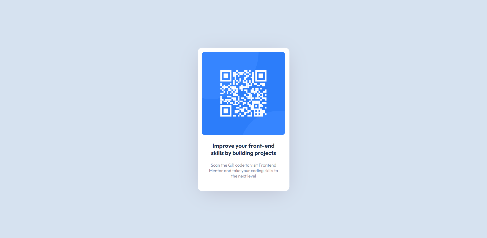

# Frontend Mentor - QR code component solution

This is a solution to the [QR code component challenge on Frontend Mentor](https://www.frontendmentor.io/challenges/qr-code-component-iux_sIO_H). Frontend Mentor challenges help you improve your coding skills by building realistic projects. 

## Table of contents

- [Screenshot](#screenshot)
- [Links](#links)
- [My process](#my-process)
- [Built with](#built-with)
- [Author](#author)

## Screenshot

## Links

- Solution URL: [frontendmentor.io](https://www.frontendmentor.io/solutions/qr-code-component-challenge-htmlcss-project-URis-SSGBN)
- Live Site URL: [weberowsky.github.io](https://weberowsky.github.io/QR-Code-Component-Challenge-HTML-CSS-Project/)

## Built with

- CSS
- HTML

## Author

- Website - [Weberowsky](https://weberowsky.space)
- Frontend Mentor - [@weberowsky](https://www.frontendmentor.io/profile/weberowsky)
